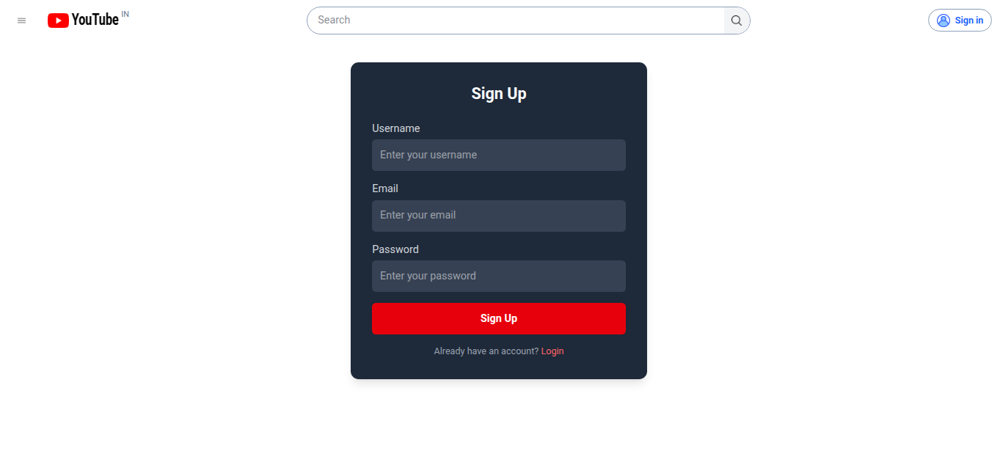
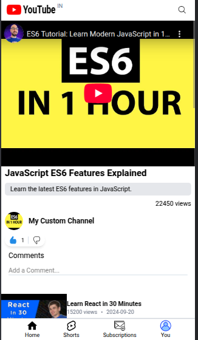

# YouTube Clone

## Overview

YouTube Clone is a replica of YouTube that allows users to browse and watch videos. The platform includes features such as searching videos, filtering content, liking and commenting on videos, and creating user channels. Only logged-in users can access the content, ensuring a personalized experience.

## Features

- **User Authentication**: Sign up and login functionality using JWT authentication.
- **Video Browsing**: Users can scroll and browse through available videos (15 test videos added).
- **Search & Filters**: Search videos by title and filter them based on predefined categories.
- **Watch Page**: Users can click on a video to watch it, like, comment, and view recommendations.
- **Channel Creation**: Users without a channel can create one.
- **Like & Comment System**: Like and comment on videos.
- **Recommended Videos**: Display of related videos on the watch page.
- **Fully Responsive**: Works across mobile, tablet, and web screens.

## Tech Stack

- **Frontend**: React + Vite, Tailwind CSS, React Router
- **Backend**: Node.js, Express.js, MongoDB
- **Authentication**: JSON Web Tokens (JWT)
- **Architecture**: Follows MVC pattern

## Prerequisites

Before running this project, ensure you have the following installed:

- [Node.js](https://nodejs.org/) (Latest LTS recommended)
- [MongoDB](https://www.mongodb.com/) (Ensure MongoDB is running locally or use a cloud database like MongoDB Atlas)

## Installation & Setup

1. **Clone the repository**

   ```sh
   git clone https://github.com/Viraj2112/Youtube_Clone.git
   cd youtube-clone
   ```

2. **Backend Setup**

   ```sh
   cd vite-project/NodeJS
   npm install
   ```

   Create a `.env` file inside `NodeJS` and add:

   ```env
   PORT=5000
   MONGODB_URL=your_mongodb_connection_string
   FRONTEND_URL=http://localhost:5173
   JWT_SECRET=your_secret_key
   ```

3. **Start the Backend Server**

   ```sh
   npm start
   ```

4. **Frontend Setup**

   ```sh
   cd ..  # Navigate back to vite-project folder
   npm install
   npm run dev
   ```

5. **Access the application** Open your browser and go to:

   ```sh
   http://localhost:5173
   ```

## API Endpoints

### **Authentication**

- `POST /signup` → Register a new user
- `POST /login` → Login user and return JWT token
- `GET /getUser` → Get user details from token

### **Videos**

- `GET /videos` → Fetch all videos (Requires authentication)
- `GET /videos/by-user/:userId` → Fetch videos uploaded by a user
- `DELETE /videos/:videoId` → Delete a video (Requires authentication)

### **Comments**

- `GET /comment/:id` → Fetch all comments for a video
- `GET /singlecomment/:id` → Fetch a specific comment
- `POST /comment` → Add a new comment
- `DELETE /comment/:id` → Delete a comment
- `PUT /comment/:id` → Update a comment

### **Likes & Dislikes**

- `PUT /like/:videoId` → Like a video
- `PUT /dislike/:videoId` → Dislike a video

### **Channels**

- `POST /createChannel` → Create a new channel
- `GET /checkUserChannel/:userId` → Check if a user has a channel

## Future Enhancements

- ✅ Video upload functionality
- ✅ Subscription feature for channels
- ✅ Improved search with tags and categories
- ✅ Deployment to Vercel / Netlify

## Screenshots







## License

This project is open-source and available under the MIT License.

## Contributing

Contributions are welcome! Feel free to fork the repo and submit a pull request.

---